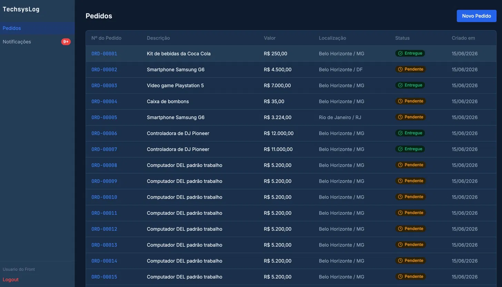
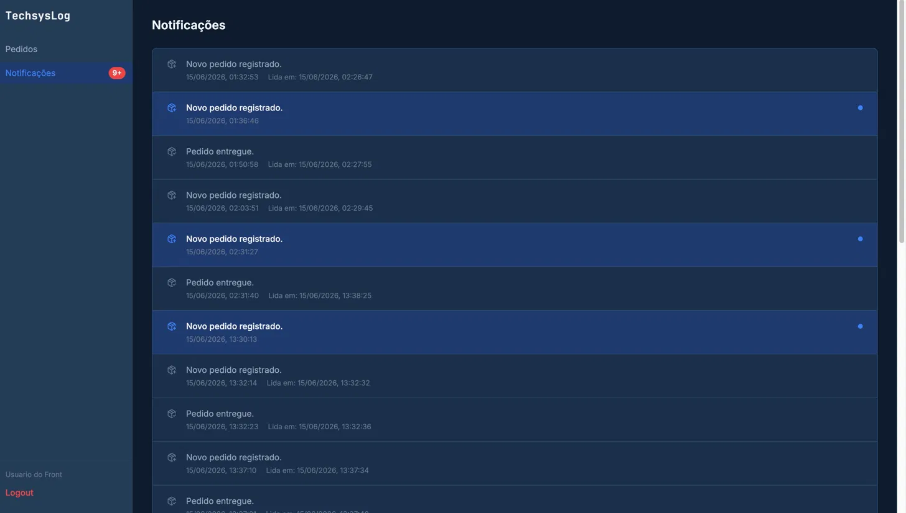
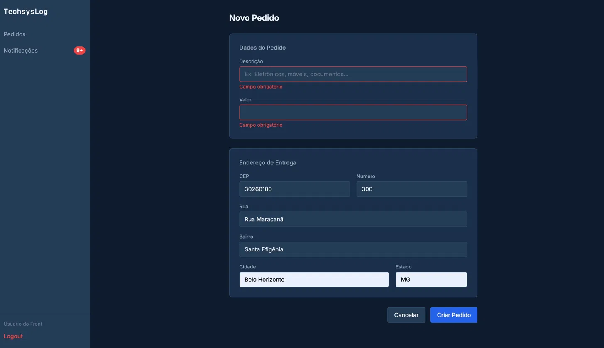
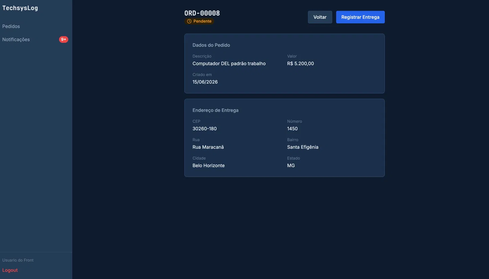

# TechsysLog — Frontend

Cliente web para o sistema de gerenciamento de pedidos e entregas da **TechsysLog**, desenvolvido como parte de um desafio técnico em **React + TypeScript + Tailwind CSS v4**, com suporte a notificações em tempo real via **SignalR**.

> 🇬🇧 [English summary](#english-summary) available at the bottom of this document.

> 🔗 **Backend:** [TechsysLog API](https://github.com/filipembraga/TechsysLog-api) — ASP.NET Core + MongoDB + SignalR

> O servidor de desenvolvimento roda em HTTPS (`https://localhost:3000`) — necessário para o cookie de Refresh Token, que usa `SameSite=Strict` (ver Decisões de Arquitetura).

---

## Telas

### Painel de Pedidos



### Notificações em Tempo Real



### Novo Pedido com Auto-preenchimento de Endereço



### Detalhe do Pedido



---

## Stack

| Categoria           | Tecnologia                                  |
| ------------------- | ------------------------------------------- |
| Framework           | React 18 + TypeScript                       |
| Build               | Vite                                        |
| Estilização         | Tailwind CSS v4 com `@tailwindcss/vite`     |
| Roteamento          | React Router v6                             |
| Estado assíncrono   | TanStack Query v5                           |
| Formulários         | React Hook Form + Zod                       |
| Tempo real          | `@microsoft/signalr`                        |
| Internacionalização | react-i18next (PT-BR padrão, EN disponível) |
| HTTP                | Axios com interceptors JWT                  |
| Toasts              | Sonner                                      |
| Ícones              | Lucide React                                |
| Testes              | Vitest + React Testing Library              |

---

## Índice

- [Sobre](#sobre)
- [Arquitetura](#arquitetura)
- [Decisões de Arquitetura](#decisões-de-arquitetura)
- [Trade-offs](#trade-offs)
- [Estrutura do Projeto](#estrutura-do-projeto)
- [Como Executar](#como-executar)
- [Funcionalidades](#funcionalidades)
- [Observabilidade](#observabilidade)
- [O que Ficou de Fora](#o-que-ficou-de-fora)
- [Evolução Futura](#evolução-futura)
- [English Summary](#english-summary)

---

## Sobre

Interface web para a empresa de logística **TechsysLog**, que permite cadastrar pedidos, acompanhar status de entregas e receber notificações operacionais em tempo real.

O frontend consome a [TechsysLog API](https://github.com/filipembraga/TechsysLog) via REST e mantém uma conexão persistente com o Hub SignalR para receber eventos sem polling. A aplicação foi construída com foco em experiência operacional B2B — densidade de informação, feedback imediato e navegação eficiente.

---

## Arquitetura

```
┌─────────────────────────────────────────────┐
│                   React UI                  │
│         Pages + Components + Hooks          │
└────────────────┬────────────────────────────┘
                 │
     ┌───────────┴───────────┐
     │                       │
     ▼                       ▼
TanStack Query          useSignalR
(cache + REST)      (WebSocket persistente)
     │                       │
     ▼                       │
 Axios Client          Invalida cache
(interceptors JWT)           │
     │                       │
     └───────────┬───────────┘
                 │
                 ▼
         ASP.NET Core API
       REST + SignalR Hub
                 │
                 ▼
             MongoDB
```

O SignalR não é fonte de dados — é um sinal de invalidação. Quando um evento chega, o `useSignalR` invalida o cache do TanStack Query, que recarrega os dados via REST. O REST permanece como fonte da verdade.

---

## Decisões de Arquitetura

### Idioma do código

Todo o código, comentários e nomes de variáveis estão em inglês. O PT-BR é o idioma da interface — gerenciado via `react-i18next` — não do código-fonte. Comentários só existem quando explicam intenção não óbvia; código autodescritivo não é comentado.

---

### Tailwind CSS v4

O projeto usa Tailwind v4 com `@tailwindcss/vite`, que elimina o arquivo `tailwind.config.js` em favor de tokens definidos diretamente em CSS via `@theme`. Todos os tokens de cor, tipografia e superfície vivem em `src/styles/tokens.css` — o CSS é a fonte da verdade, não um arquivo de configuração JavaScript.

---

### TanStack Query + SignalR como camada de dados

O TanStack Query gerencia cache, loading states e invalidação. O SignalR não substitui o cache — ele o invalida. Quando um evento `ReceiveNotification` chega, o hook `useSignalR` invalida as queries relevantes e o TanStack Query recarrega os dados via REST.

```
Evento SignalR chega
  → useSignalR invalida queryKeys.notifications
    → TanStack Query recarrega GET /api/Notifications
      → UI atualiza automaticamente
```

Essa separação mantém o SignalR responsável apenas por sinalizar mudanças, e o REST como fonte da verdade dos dados.

---

### Autenticação — Access Token em memória + Refresh Token via cookie httpOnly

O Access Token vive só em memória (`src/lib/tokenStore.ts`, uma variável de módulo fora da árvore React) — nunca em `localStorage`, eliminando exposição a XSS. Ele é perdido a cada reload da página, de propósito: a sessão é restaurada via `POST /api/Auth/refresh`, chamado automaticamente no mount do `AuthProvider`, usando o cookie `httpOnly` que o navegador já envia sozinho.

Quando uma requisição falha com `401`, o interceptor de resposta do Axios tenta renovar o token automaticamente antes de desistir — com deduplicação de chamadas simultâneas (uma `Promise` compartilhada em `client.ts`, evitando múltiplos `/refresh` paralelos se vários requests expirarem ao mesmo tempo). Se o refresh também falhar, a navegação para `/login` é feita via React Router (`src/lib/navigation.ts`, ponte fora da árvore React para `useNavigate`) — não `window.location.href` — preservando o estado da aplicação e a rota de origem (`location.state.from`), usada para retornar o usuário exatamente de onde saiu após logar novamente.

`AuthContext` foi dividido em dois arquivos (`AuthContext.tsx` para o Provider, `useAuth.ts` para o hook de consumo) para satisfazer a regra do React Fast Refresh, que exige que um arquivo exportando componentes não exporte mais nada além disso.

---

### HTTPS em desenvolvimento — Schemeful Same-Site

O cookie do Refresh Token usa `SameSite=Strict`. O Chrome trata origens com **esquemas diferentes** (`http` vs `https`) como cross-site mesmo no mesmo domínio (`localhost`) — Schemeful Same-Site — bloqueando silenciosamente o envio do cookie. O servidor de desenvolvimento do Vite roda em HTTPS (`@vitejs/plugin-basic-ssl`, `vite.config.ts`) para igualar o esquema do backend, preservando `SameSite=Strict` sem reduzir a proteção contra CSRF.

---

### Enums como `const` objects

Em vez de `enum` nativo do TypeScript (que gera código JavaScript em runtime), os status são modelados como objetos `as const` com `type` derivado:

```typescript
export const OrderStatus = {
  Pending: 'Pending',
  Shipped: 'Shipped',
  Delivered: 'Delivered',
  Cancelled: 'Cancelled',
} as const

export type OrderStatus = (typeof OrderStatus)[keyof typeof OrderStatus]
```

Isso garante type safety sem overhead de runtime e alinha diretamente com o contrato da API — o backend serializa enums como strings semânticas.

---

### NotificationType para i18n

As mensagens de notificação chegam do backend em inglês. Em vez de exibir texto livre da API, o frontend mapeia o campo `type` (`OrderRegistered`, `OrderDelivered`) para chaves i18n e exibe o texto no idioma correto. A `message` do backend é ignorada na UI — o contrato semântico é o `type`.

---

### Badge de urgência progressiva

O contador de notificações não lidas na sidebar usa limite de `9+` — padrão de sistemas operacionais B2B onde cada notificação representa um evento de negócio. Além do limite, a cor muda de azul para vermelho, comunicando urgência sem precisar de texto adicional.

---

### Toast de erro com Correlation ID

Erros de rede e `5xx` exibem um toast com o Correlation ID truncado (8 caracteres) em vez do UUID completo, evitando quebra de linha e priorizando legibilidade — o valor completo só é necessário para suporte, não para leitura visual imediata.

O toast não expira por tempo (`duration: Infinity`), diferente do padrão dos demais toasts do app. A decisão evita que o operador perca o ID por timeout antes de copiá-lo: o fechamento passa a ser sempre intencional, via botão de copiar ou fechamento manual.

A cópia usa `navigator.clipboard.writeText` sobre o UUID completo — nunca sobre a versão truncada exibida — seguido de um toast de confirmação com timeout padrão, já que essa segunda mensagem é só uma confirmação rápida, sem necessidade de permanência.

---

### YAGNI

Nenhuma abstração foi criada sem uso imediato. Exemplos de decisões explícitas:

- Sem componente `AuthForm` base — apenas dois formulários, refatoração futura
- Sem `cva` para variantes de componente — `tailwind-merge` resolve o escopo atual
- Sem CSS Modules — Tailwind inline elimina dead CSS por design

---

## Trade-offs

### `SameSite=Strict` vs `SameSite=None`

Com frontend e backend em esquemas diferentes (HTTP vs HTTPS), `SameSite=Strict` bloquearia o envio do cookie de refresh (Schemeful Same-Site). A correção foi igualar os esquemas (HTTPS nos dois lados em dev), preservando `Strict` — mais protegido contra CSRF que relaxar para `None`, que exigiria abrir mão dessa proteção só por uma limitação de ambiente local.

---

### Broadcast vs SignalR Groups

Hoje todas as notificações chegam a todos os clientes conectados. O filtro acontece no frontend — cada usuário vê apenas suas notificações ao consultar a API REST.

O correto para escala seria SignalR Groups: o Hub adiciona cada conexão ao grupo do `userId` no handshake, e eventos são emitidos apenas para o grupo correto. Elimina tráfego desnecessário entre clientes.

---

### Internacionalização do CEP

O frontend aceita qualquer formato de CEP (mínimo 4, máximo 10 caracteres). Se o valor digitado resultar em 8 dígitos após limpeza, a consulta ao ViaCEP é tentada automaticamente. Caso contrário, o campo é enviado ao backend como digitado — permitindo endereços internacionais sem bloqueio de formato.

Um seletor de país com validação específica por região seria a evolução natural para um produto totalmente internacionalizado.

---

### CEP — Formato brasileiro vs. endereços internacionais

O campo aceita qualquer formato. Antes do envio, o valor limpo terá exatamente 8 caracteres, caso esteja no padrão brasileiro (não numéricos são removidos conforme padrão brasileiro). Caso contrário, o valor original é preservado — respeitando formatos como `SW1A 1AA` ou `10001` sem alterações. O enriquecimento ViaCEP é tentado silenciosamente para CEPs brasileiros e ignorado para todos os outros.

---

## Estrutura do Projeto

```
src/
├── api/
│   ├── client.ts          # Axios + interceptors JWT + Correlation ID + handler 401/5xx
│   └── services.ts        # authService, ordersService, notificationsService
│
├── components/
│   ├── layout/
│   │   └── AppLayout.tsx  # Sidebar + Outlet + useSignalR + badge de não lidas
│   └── ui/
│       ├── Button.tsx     # forwardRef, variantes, tailwind-merge
│       ├── Input.tsx      # forwardRef, label, error i18n, hint
│       ├── StatusBadge.tsx # ícone Lucide + cor semântica + texto i18n
│       └── index.ts
│
├── constants/
│   └── orderStatus.tsx    # ORDER_STATUS — mapa de status para ícone, cor e i18nKey
│
├── context/
│   ├── AuthContext.tsx    # AuthProvider — token (memória) + user + isLoaded + login/logout
│   └── useAuth.ts         # hook de consumo, separado por exigência do Fast Refresh
│
├── hooks/
│   ├── useViaCep.ts            # debounce 600ms + auto-fill de endereço
│   ├── useViaCep.test.ts       # testes unitários — debounce, boundary, sucesso/falha
│   ├── useSignalR.ts           # conexão ao Hub + invalidação de cache + toast i18n
│   └── useSignalR.test.ts      # testes unitários — lifecycle, falha de conexão, notificação recebida
│
├── i18n/
│   ├── index.ts           # configuração — PT-BR padrão
│   └── locales/
│       ├── en.ts
│       └── pt-BR.ts
│
├── lib/
│   ├── correlationId.ts   # gera UUID v4 por requisição (X-Correlation-Id)
│   ├── navigation.ts      # ponte para useNavigate fora da árvore React
│   ├── tokenStore.ts      # access token em memória, fora do React
│   ├── queryClient.ts     # QueryClient + queryKeys centralizados
│   └── schemas.ts         # loginSchema, registerSchema, orderSchema (Zod)
│
├── pages/
│   ├── LoginPage.tsx
│   ├── RegisterPage.tsx
│   ├── OrdersPage.tsx         # tabela de pedidos + StatusBadge
│   ├── NewOrderPage.tsx       # formulário + ViaCEP auto-fill
│   ├── OrderDetailPage.tsx    # detalhes + Registrar Entrega
│   └── NotificationsPage.tsx  # log de notificações + marcar como lida
│
├── types/
│   ├── index.ts           # OrderStatus, NotificationType, Order, AppNotification
│   └── dtos.ts            # UserDto, LoginResponseDto — contratos de resposta da API
│
└── styles/
    └── tokens.css         # @theme — tokens de cor e tipografia (fonte da verdade Tailwind v4)
```

---

## Como Executar

### Pré-requisitos

- [Node.js 18+](https://nodejs.org)
- [TechsysLog API](https://github.com/filipembraga/TechsysLog) rodando localmente

### Passos

**1. Clonar o repositório**

```bash
git clone https://github.com/filipembraga/TechsysLog-frontend.git
cd TechsysLog-frontend
```

**2. Instalar dependências**

```bash
npm install
```

**3. Iniciar em desenvolvimento**

```bash
npm run dev
```

A aplicação estará disponível em `http://localhost:3000`.

> O backend deve estar rodando em `https://localhost:7260`. A URL base está configurada em `src/api/client.ts`.

## Testes

### Executar

```bash
npm test
```

### Cobertura atual

| Hook         | Cenários testados                                                                                                                                                                                      |
| ------------ | ------------------------------------------------------------------------------------------------------------------------------------------------------------------------------------------------------ |
| `useViaCep`  | CEP incompleto não dispara busca; debounce de 600ms (boundary test); retorno de endereço em busca bem-sucedida                                                                                         |
| `useSignalR` | Sem token não cria conexão; conexão criada e iniciada com token válido; falha ao conectar exibe toast de erro; notificação recebida invalida queries e exibe toast; cleanup encerra conexão no unmount |

Hooks foram escolhidos como alvo inicial de testes por concentrarem lógica de negócio isolada da UI — debounce, conexão WebSocket, invalidação de cache — sem exigir simulação de componentes visuais completos.

Dependências externas (`fetch`, `@microsoft/signalr`, `@tanstack/react-query`, `sonner`, `react-i18next`) são mockadas via `vi.mock`, garantindo testes rápidos e independentes de rede ou infraestrutura real.

---

## Funcionalidades

### Autenticação

- Cadastro e login com validação via Zod
- Access Token em memória, renovado automaticamente via Refresh Token (cookie `httpOnly`) — sessão sobrevive a reload da página sem expor token a XSS
- Fila de deduplicação de refresh: requisições simultâneas que expiram ao mesmo tempo compartilham uma única chamada de renovação
- Redirecionamento automático em rotas protegidas (`ProtectedRoute`) e públicas (`PublicRoute`), preservando a rota de origem para retorno pós-login
- Logout avisa o backend (invalida o Refresh Token) antes de limpar o estado local

### Pedidos

- Listagem em tabela com `StatusBadge` semântico (ícone + cor + texto i18n)
- Clique na linha navega para o detalhe do pedido
- Criação com auto-preenchimento de endereço via **ViaCEP** (debounce 600ms)
- Validação de formulário em tempo real com mensagens i18n
- Registro de entrega diretamente na página de detalhe
- Busca por número do pedido, descrição, cidade ou estado, combinada com filtro de status

### Notificações em Tempo Real

- Conexão persistente com Hub SignalR via WebSocket
- Token JWT enviado via `accessTokenFactory` (WebSockets não suportam headers customizados)
- Reconexão automática com backoff exponencial (`withAutomaticReconnect`)
- Toast no idioma correto ao receber evento — mapeado por `NotificationType`, não pela mensagem do backend
- Badge de não lidas na sidebar com limite de urgência: azul até 9, vermelho acima de 9+
- Log de notificações com distinção visual entre lidas e não lidas
- Clique marca como lida e navega para o pedido associado
- `readAt` exibido para auditoria de quando a notificação foi lida

---

## Observabilidade

### Implementado

| Mecanismo                         | Implementação                                                                                                                                                                                       |
| --------------------------------- | --------------------------------------------------------------------------------------------------------------------------------------------------------------------------------------------------- |
| **Correlation ID**                | Cada requisição recebe um UUID v4 (`crypto.randomUUID()`) anexado ao header `X-Correlation-Id`, gerado no request interceptor do Axios e validado/ecoado pelo middleware já implementado no backend |
| **Captura centralizada de erros** | O response interceptor do Axios intercepta erros de rede e respostas `5xx` em um único ponto — `4xx` de negócio (404, 401) seguem fluxo próprio, sem Correlation ID                                 |
| **Feedback ao operador**          | Toast (Sonner) com o Correlation ID truncado (8 caracteres) e ação de copiar o UUID completo para a área de transferência — pensado para o operador referenciar o ID ao abrir um chamado de suporte |
| **Logging local**                 | `console.error` com o Correlation ID como prefixo, permitindo cruzar rapidamente o erro exibido ao operador com o objeto de erro completo no DevTools                                               |

A arquitetura está preparada para adoção sem refatoração de camadas adicionais:

**Erros de cliente** — o branch de captura já existe no interceptor; um serviço de monitoramento como **Sentry** ou **Application Insights** se integra em uma única linha, dentro do mesmo bloco que já trata Correlation ID:

```typescript
// src/api/client.ts — branch de erro já implementado
if (isNetworkOrServerError) {
  console.error(`[${correlationId}]`, error)
  toast.error(t('errors.generic'), {
    /* ... */
  })
  Sentry.captureException(error, { tags: { correlationId } }) // próximo passo — zero impacto na arquitetura
}
```

**Correlação REST + SignalR** — cada notificação recebida via SignalR carrega `id` e `orderId`, permitindo correlacionar eventos de tempo real com requisições REST no log centralizado.

**OpenTelemetry** — instrumentação de frontend via `@opentelemetry/sdk-web` pode capturar traces de navegação, erros de rede e métricas de performance sem mudanças nos componentes.

**Próximos passos recomendados:** Sentry para erros de cliente e Web Vitals para performance.

---

## O que Ficou de Fora

| Item                                        | Motivo                                                                                                                     |
| ------------------------------------------- | -------------------------------------------------------------------------------------------------------------------------- |
| **Formatação de datas com locale dinâmico** | Requer `date-fns` + locale dinâmico vinculado ao i18n ativo. `toLocaleString('pt-BR')` como solução provisória             |
| **`orderNumber` nas notificações**          | Payload atual tem `orderId` mas não o número legível. Exigiria mudança no contrato da API ou request extra por notificação |
| **Toast de notificações configurável**      | Hoje é global para todos os usuários. Configuração por usuário ou perfil é evolução natural                                |
| **Paginação**                               | Não implementada dado o volume esperado no contexto do desafio                                                             |
| **Cancelamento de pedido**                  | Requer modal de confirmação com cor `danger` — melhoria futura                                                             |
| **Máscara de moeda**                        | `react-number-format` seria a lib adequada — YAGNI no escopo atual                                                         |
| **Exportação XLSX**                         | SheetJS disponível no ecossistema — melhoria futura                                                                        |
| **Visão Admin**                             | Requer `role` no token JWT e guards de rota adicionais                                                                     |
| **Dark mode toggle**                        | Sistema já é dark por padrão — toggle seria configuração por usuário                                                       |

---

## Evolução Futura

### Internacionalização de datas

Substituir `toLocaleString('pt-BR')` hardcoded por `date-fns` com locale dinâmico vinculado ao i18n ativo:

```typescript
import { format } from 'date-fns'
import { ptBR, enUS } from 'date-fns/locale'

const locale = i18n.language === 'pt-BR' ? ptBR : enUS
format(new Date(date), 'dd/MM/yyyy HH:mm', { locale })
```

### SignalR por usuário

Hoje o backend faz broadcast para todos os clientes conectados. A evolução natural é SignalR Groups — o Hub adiciona cada conexão ao grupo do `userId`, e eventos são enviados apenas para o usuário correto.

### `orderNumber` nas notificações

Incluir o número legível do pedido (`ORD-00001`) no payload de notificação permitiria exibir mensagens mais contextuais na lista, sem request adicional.

---

## English Summary

Web client for the **TechsysLog** order and delivery management system, built as a technical challenge using **React 18 + TypeScript + Tailwind CSS v4**, with real-time notifications via **SignalR**.

### Architecture

The application follows a clear separation of concerns: **API layer** (Axios client with JWT interceptors + typed services), **state layer** (TanStack Query for server state, React Context for auth), **real-time layer** (`useSignalR` hook mounted at layout level), and **UI layer** (pages + reusable components with Tailwind inline styles).

Key decisions: Tailwind v4 with CSS-first token configuration (`@theme` in `tokens.css`); `const` objects over TypeScript native enums; SignalR as a cache invalidation signal rather than a data source; in-memory access token with httpOnly-cookie refresh flow instead of localStorage, avoiding XSS exposure while surviving page reloads via silent refresh on mount.

### Backend

REST API: [github.com/filipembraga/TechsysLog](https://github.com/filipembraga/TechsysLog) — ASP.NET Core + MongoDB + SignalR

### Running

```bash
git clone https://github.com/filipembraga/TechsysLog-frontend.git
cd TechsysLog-frontend
npm install
npm run dev
```

Requires the backend running at `https://localhost:7260`.
